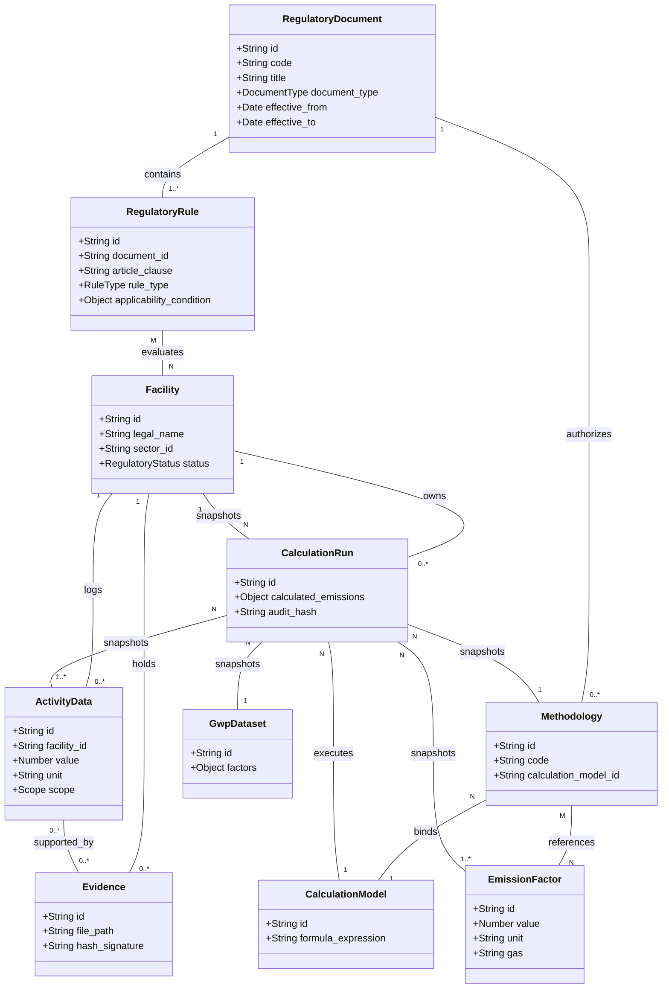

# ENERIX Carbon — Formal Domain Model Specification
## Document ID: EC-DM-001
**Title:** ENERIX Carbon Domain Model — Canonical Conceptual Domain Model & Relationship Specification  
**Version:** 1.0.0  
**Status:** APPROVED_BASELINE  
**Effective Date:** 2026-09-16  
**Authors:** ENERIX Carbon Architecture Working Group  
**Governing Documents:**
- `EC-CONTEXT-001` (Master Architecture & Context Specification)
- `EC-DOMAIN-MODEL-001.yaml` (Formal Domain Model Baseline)
- `EC-CALCULATION-MODEL-CATALOG-001.yaml` (Calculation Model Catalog)
- `EC-UCM-001` (Universal Emission Calculation Model Specification)
- `EC-KM-001` (Knowledge Matrix & Authority Mapping Specification)
- `ADR-000-CONTEXT-REHYDRATION` (Master Context Rehydration ADR)

---

## 1. Document Control

| Metadata Field | Value |
| :--- | :--- |
| **Document ID** | `EC-DM-001` |
| **Document Title** | ENERIX Carbon Domain Model Specification |
| **Artifact Class** | Formal Engineering Architecture & Domain Model Specification |
| **Version** | `1.0.0` |
| **Status** | `APPROVED_BASELINE` |
| **Release Date** | 2026-09-16 |
| **Maintainer** | ENERIX Domain Architecture & Information Governance Committee |
| **Repository Location** | `/carbon/docs/data-model/EC-DM-001.md` |
| **Machine-Readable Spec** | `/carbon/docs/data-model/EC-DM-001.yaml` |

---

## 2. Purpose

The purpose of **EC-DM-001** is to establish the canonical, conceptual domain model for ENERIX Carbon. It defines the core domain entities, value objects, identifiers, relationships, cardinalities, invariants, temporal semantics, versioning policies, and lifecycle rules governing the ENERIX Carbon platform.

This specification serves as the authoritative conceptual reference for all downstream specifications, including:
- Regulatory Rule Model (`EC-RRM-001`)
- Temporal Regulation Model (`EC-TEMP-001`)
- Sector Profile Model (`EC-SPM-001`)
- Methodology Registry (`EC-MTH-001`)
- Emission Factor Registry (`EC-EFR-001`)
- GWP Dataset Specification (`EC-GWP-001`)
- Calculation Engine Specification (`EC-CES-001`)
- Test Corpus Specification (`EC-TEST-001`)

---

## 3. Scope

This specification governs the conceptual architecture of the ten canonical domain entities, their supporting value objects, and their domain boundaries across ENERIX Carbon.

### Governing Constraints:
- **Conceptual Model, Not Physical Schema:** EC-DM-001 defines domain semantics, business rules, and entity boundaries. It does NOT define SQL DDL, ORM mappings, or database tables.
- **Derived from Product Domain, Not Implementation Code:** EC-DM-001 is derived strictly from standard carbon accounting practices (ISO 14064, GHG Protocol), Vietnamese environmental regulations (Decree 06/2022, Decision 42/2026), `EC-CONTEXT-001`, `EC-UCM-001`, and `EC-KM-001`. It is NEVER reverse-engineered from temporary UI code or transient JavaScript objects.
- **No Structural Overwrite:** Existing database/UI code is evidence of implementation state, not domain authority.

---

## 4. Domain Principles

The Domain Model is anchored in the 15 Engineering Laws of ENERIX Carbon (`EC-CONTEXT-001`):

1. **Formula is NOT an Emission Factor (LAW-002):** `CalculationModel` (mathematical contract), `EmissionFactor` (versioned coefficient), and `Methodology` (MRV rules) MUST remain distinct entities.
2. **Current Law is Time-Dependent (LAW-004 & LAW-015):** Temporal validity (`effective_from`, `effective_to`) is mandatory across all regulatory rules, methodologies, and emission factors.
3. **Calculation History is Immutable (LAW-005):** `CalculationRun` execution snapshots CANNOT be modified in-place. Recalculation creates a new versioned `CalculationRun`.
4. **Activity Data is NOT a Calculated Result (LAW-010):** Input activity measurements (`ActivityData`) MUST remain strictly isolated from output emissions.
5. **Evidence is NOT Authority (LAW-011):** Operational physical evidence (`Evidence`) substantiates activity quantities; it does NOT establish legal obligations or alter factor values.
6. **Sector Taxonomy Preserves Regulatory Mapping (LAW-013):** Facilities map to specific sub-sectors, but MUST maintain explicit linkages to the official 6-sector regulatory taxonomy established under Decision 42/2026/QĐ-TTg.

---

## 5. Domain Boundaries & Taxonomy

To prevent concept collapse, ENERIX Carbon enforces nine strict domain boundaries:

```
┌────────────────────────────────────────────────────────────────────────┐
│                        KNOWLEDGE & REGULATORY DOMAIN                   │
│  RegulatoryDocument ──> KnowledgeAssertion ──> RegulatoryRule          │
└───────────────────────────────────┬────────────────────────────────────┘
                                    │ Governs Applicability
                                    ▼
┌────────────────────────────────────────────────────────────────────────┐
│                     FACILITY & OPERATIONAL DOMAIN                      │
│  Facility (Site / Facility Unit / Operational Boundary)                │
└───────────────────────────────────┬────────────────────────────────────┘
                                    │ Owns Inputs & Evidence
                                    ▼
┌────────────────────────────────────────────────────────────────────────┐
│                     ACTIVITY DATA & EVIDENCE DOMAIN                    │
│  ActivityData <── supported by ── Evidence                             │
└───────────────────────────────────┬────────────────────────────────────┘
                                    │ Binds to Methodology
                                    ▼
┌────────────────────────────────────────────────────────────────────────┐
│                        METHODOLOGY & FACTOR DOMAIN                     │
│  Methodology ──> CalculationModel, EmissionFactor, GwpDataset          │
└───────────────────────────────────┬────────────────────────────────────┘
                                    │ Snapshot & Execute
                                    ▼
┌────────────────────────────────────────────────────────────────────────┐
│                         CALCULATION RUN DOMAIN                         │
│  CalculationRun (Immutable Execution Snapshot & Provenance Record)     │
└────────────────────────────────────────────────────────────────────────┘
```

### Critical Concept Boundaries (What is NOT What):
- **`RegulatoryDocument` $\ne$ `RegulatoryRule`:** A document (e.g., Decree 06/2022) is an issued legal instrument. A rule is a specific, evaluable applicability condition derived from an article/clause within that document.
- **`RegulatoryRule` $\ne$ `KnowledgeAssertion`:** A rule is a formal legal applicability predicate (`EC-REG-001`). An assertion is a broader source-backed knowledge statement (`EC-KM-001`).
- **`KnowledgeAssertion` $\ne$ `Methodology`:** An assertion records what a source states. A methodology defines the step-by-step technical calculation procedure.
- **`Methodology` $\ne$ `CalculationModel`:** A methodology binds regulatory rules, activity data requirements, and default factors. A calculation model (`MODEL-01` .. `MODEL-10`) is a pure mathematical contract ($E = AD \times EF$).
- **`CalculationModel` $\ne$ `CalculationRun`:** A model is an abstract formula contract. A run is a specific execution instance with frozen input snapshots.
- **`ActivityData` $\ne$ `Evidence`:** Activity data is a quantitative input measurement ($10,000 \, kWh$). Evidence is a verifiable proof document (electricity bill PDF, SCADA log hash).
- **`EmissionFactor` $\ne$ `GwpDataset`:** An emission factor converts activity data to gas mass ($kg CO_2 / kWh$). A GWP dataset converts individual gas masses to $CO_2$ equivalent ($tCO_2e$).
- **`Facility` $\ne$ `LegalEntity / Organization`:** A facility is a physical operational site. A legal entity is the corporate entity holding regulatory liability.
- **`CalculationRun` $\ne$ `Report`:** A run is an executed mathematical result. A report is an administrative submission document rendered from one or more runs.

---

## 6. Entity Catalogue

The ENERIX Carbon domain model consists of ten canonical entities:

| Entity ID | Entity Name | Domain Classification | Primary Purpose |
| :--- | :--- | :--- | :--- |
| `E-01` | **`RegulatoryDocument`** | Regulatory Domain | Represents authoritative legal/standard documents (Laws, Decrees, Circulars). |
| `E-02` | **`RegulatoryRule`** | Regulatory Domain | Granular applicability predicate evaluated against facility and temporal attributes. |
| `E-03` | **`Facility`** | Facility Domain | Regulated physical site, industrial plant, or commercial entity producing emissions. |
| `E-04` | **`ActivityData`** | Activity Data Domain | Quantitative metered, calculated, or logged input representing physical activity. |
| `E-05` | **`EmissionFactor`** | Factor Registry Domain | Governed, versioned coefficient converting activity data to gas mass. |
| `E-06` | **`GwpDataset`** | Factor Registry Domain | Governed set of Global Warming Potential factors (IPCC AR5, AR6). |
| `E-07` | **`Methodology`** | Methodology Domain | Technical MRV procedure specifying calculation models, required data, and EF bounds. |
| `E-08` | **`CalculationModel`** | Calculation Domain | Abstract mathematical contract (`MODEL-01` .. `MODEL-10`) defining execution formulas. |
| `E-09` | **`Evidence`** | Evidence Domain | Verifiable physical or digital artifact substantiating activity data or parameters. |
| `E-10` | **`CalculationRun`** | Calculation Domain | Immutable audit snapshot of an executed calculation instance with complete provenance. |

---

## 7. Entity Definitions

### 7.1. `RegulatoryDocument` (E-01)
* **Definition:** An official statutory instrument, legal decree, prime minister decision, ministry circular, or technical standard issued by an authoritative body.
* **Owner:** Regulatory Architecture Committee.
* **Lifecycle:** `DRAFT` $\rightarrow$ `PENDING_EFFECTIVE` $\rightarrow$ `EFFECTIVE` $\rightarrow$ `AMENDED` $\rightarrow$ `SUPERSEDED` $\rightarrow$ `ARCHIVED`.
* **Required Attributes:** `id`, `code`, `title`, `document_type`, `issuing_authority`, `issued_date`, `effective_from`, `status`, `version`.
* **Optional Attributes:** `effective_to`, `superseded_by`, `file_ref`, `source_hash`.
* **Immutability:** Immutable once status becomes `EFFECTIVE`. Amendments create new document entries or explicit `RegulatoryRule` amendments.

### 7.2. `RegulatoryRule` (E-02)
* **Definition:** A precise, computable predicate derived from an article or clause within a `RegulatoryDocument`, governing facility applicability, threshold compliance, or methodology binding.
* **Owner:** Regulatory Rules Engine (`EC-REG-001`).
* **Lifecycle:** `ACTIVE` $\rightarrow$ `AMENDED` $\rightarrow$ `SUPERSEDED` $\rightarrow$ `EXPIRED`.
* **Required Attributes:** `id`, `document_id`, `article_clause`, `rule_type`, `sector_id`, `applicability_condition`, `effective_from`, `reporting_frequency`.
* **Optional Attributes:** `sub_sector_id`, `effective_to`, `superseded_by_rule_id`.
* **Immutability:** Immutable. Modifications require creating a new rule version with updated temporal bounds.

### 7.3. `Facility` (E-03)
* **Definition:** A physical operational site, industrial installation, commercial facility, or project entity operating within a specific jurisdiction and producing GHG emissions.
* **Owner:** Facility Operations & Compliance Manager.
* **Lifecycle:** `REGISTERED` $\rightarrow$ `ACTIVE_MANDATORY` $\rightarrow$ `ACTIVE_VOLUNTARY` $\rightarrow$ `TRANSITIONAL` $\rightarrow$ `DECOMMISSIONED` $\rightarrow$ `ARCHIVED`.
* **Required Attributes:** `id`, `code`, `legal_name`, `address`, `province`, `sector_id`, `sub_sector_id`, `business_activity`, `regulatory_status`.
* **Optional Attributes:** `tax_id`, `capacity_value`, `capacity_unit`, `latitude`, `longitude`, `parent_organization_id`.
* **Immutability:** Mutable operational attributes (name, capacity), but historical snapshots MUST be preserved for prior reporting runs.

### 7.4. `ActivityData` (E-04)
* **Definition:** A quantitative metered, calculated, or logged input value representing physical activity (e.g. coal burned, electricity consumed) over a defined reporting period.
* **Owner:** Activity Data & Measurement Team.
* **Lifecycle:** `DRAFT` $\rightarrow$ `PENDING_REVIEW` $\rightarrow$ `APPROVED` $\rightarrow$ `SUPERSEDED` $\rightarrow$ `REJECTED`.
* **Required Attributes:** `id`, `facility_id`, `activity_name`, `source_category`, `scope`, `value`, `unit`, `period_start`, `period_end`, `data_quality_tier`, `evidence_ids`.
* **Optional Attributes:** `meter_id`, `source_type`, `uncertainty_percentage`, `superseded_by_id`.
* **Immutability:** Immutable once status becomes `APPROVED`. Adjustments or corrections create a new versioned `ActivityData` record linked via `superseded_by_id`.

### 7.5. `EmissionFactor` (E-05)
* **Definition:** A versioned, governed physical coefficient converting activity data units into mass of greenhouse gas emitted ($CO_2, CH_4, N_2O$, etc.).
* **Owner:** Emission Factor Registry Manager (`EC-EFDB-001`).
* **Lifecycle:** `PROPOSED` $\rightarrow$ `GOVERNED` $\rightarrow$ `SUPERSEDED` $\rightarrow$ `DEPRECATED`.
* **Required Attributes:** `id`, `factor_name`, `activity_type`, `gas`, `value`, `unit`, `source_authority`, `source_document`, `valid_from`, `tier`.
* **Optional Attributes:** `valid_to`, `confidence_interval`, `uncertainty_pct`, `is_biogenic`.
* **Immutability:** Strictly immutable once governed. Updated factor values must be published under a new factor ID or version.

### 7.6. `GwpDataset` (E-06)
* **Definition:** A governed collection of Global Warming Potential ($GWP$) conversion factors established by an authoritative body (e.g. IPCC AR5 100-year) to aggregate individual gas species into $tCO_2e$.
* **Owner:** Technical Standards Committee.
* **Lifecycle:** `ACTIVE` $\rightarrow$ `SUPERSEDED` $\rightarrow$ `HISTORICAL`.
* **Required Attributes:** `id`, `dataset_name`, `authority`, `effective_year`, `factors`.
* **Optional Attributes:** `time_horizon_years` (default 100), `notes`.
* **Immutability:** Strictly immutable.

### 7.7. `Methodology` (E-07)
* **Definition:** A technical MRV specification defining the prescribed calculation approach, required activity data inputs, default emission factors, and bound calculation model.
* **Owner:** MRV Methodology Working Group.
* **Lifecycle:** `DRAFT` $\rightarrow$ `APPROVED` $\rightarrow$ `REVISED` $\rightarrow$ `SUPERSEDED`.
* **Required Attributes:** `id`, `code`, `title`, `governing_document_id`, `applicable_sectors`, `calculation_model_id`, `supported_scopes`, `required_activity_units`, `default_ef_ids`.
* **Optional Attributes:** `tier_level`, `uncertainty_method`, `effective_to`.
* **Immutability:** Immutable once approved. Revisions spawn new methodology versions.

### 7.8. `CalculationModel` (E-08)
* **Definition:** An abstract mathematical contract definition (`MODEL-01` through `MODEL-10`) specifying the exact formula expression, input parameters, constraints, and output schema.
* **Owner:** Lead Calculation Engine Architect (`EC-UCM-001`).
* **Lifecycle:** `STABLE_SPECIFICATION` $\rightarrow$ `DEPRECATED`.
* **Required Attributes:** `id`, `name`, `formula_expression`, `required_inputs`, `required_parameters`, `output_schema`.
* **Optional Attributes:** `constraints_expression`, `description`.
* **Immutability:** Strictly immutable. Formula changes require a new model identifier or major version update.

### 7.9. `Evidence` (E-09)
* **Definition:** A physical or digital verification artifact (utility invoice, meter log file, SCADA export, laboratory calibration report) substantiating an `ActivityData` quantity or factor parameter.
* **Owner:** Evidence & Assurance Custodian.
* **Lifecycle:** `UPLOADED` $\rightarrow$ `VERIFIED` $\rightarrow$ `REJECTED` $\rightarrow$ `ARCHIVED`.
* **Required Attributes:** `id`, `facility_id`, `title`, `evidence_type`, `file_path`, `issue_date`, `hash_signature`.
* **Optional Attributes:** `verified_by`, `verification_date`, `metadata_json`.
* **Immutability:** Cryptographically immutable via `hash_signature` (SHA-256).

### 7.10. `CalculationRun` (E-10)
* **Definition:** An immutable audit record of a single executed calculation instance, containing complete snapshots of inputs, parameters, factor versions, engine build version, calculated emission outputs, and provenance hashes.
* **Owner:** Deterministic Calculation Engine (`EC-CES-001`).
* **Lifecycle:** `EXECUTED` $\rightarrow$ `VERIFIED` $\rightarrow$ `SUPERSEDED_BY_RECALCULATION` $\rightarrow$ `ARCHIVED`.
* **Required Attributes:** `id`, `facility_id`, `reporting_period`, `methodology_id`, `model_id`, `activity_data_snapshot`, `emission_factor_snapshot`, `gwp_dataset_snapshot`, `parameters_snapshot`, `calculated_emissions`, `executed_at`, `engine_version`, `audit_hash`.
* **Optional Attributes:** `recalculation_reason`, `prior_run_id`, `qa_status`.
* **Immutability:** 100% Immutable (`LAW-005`). CANNOT be modified or deleted.

---

## 8. Identifier Model

To guarantee global traceability, ENERIX Carbon enforces strict, prefix-based canonical identifier rules across all entities:

| Entity | Identifier Format Pattern | Example Canonical ID |
| :--- | :--- | :--- |
| `RegulatoryDocument` | `DOC-{TYPE}-{ISSUER}-{YEAR}-{SEQ}` | `DOC-DEC-GOV-2022-06` |
| `RegulatoryRule` | `RULE-{DOC_ID}-{ARTICLE/CLAUSE}` | `RULE-DOC-DEC-GOV-2022-06-A2C1` |
| `Facility` | `FAC-{PROVINCE}-{SECTOR}-{SEQ}` | `FAC-HD-ENG-001` |
| `ActivityData` | `AD-{FAC_ID}-{PERIOD}-{SEQ}` | `AD-FAC-HD-ENG-001-2025Q1-01` |
| `EmissionFactor` | `EF-{AUTHORITY}-{ACTIVITY}-{YEAR}` | `EF-MONRE-GRID-2024` |
| `GwpDataset` | `GWP-{AUTHORITY}-{VERSION}` | `GWP-IPCC-AR5-100YR` |
| `Methodology` | `METH-{MINISTRY}-{CODE}` | `METH-MOIT-38-01` |
| `CalculationModel` | `MODEL-{ID}` | `MODEL-03` |
| `Evidence` | `EVI-{FAC_ID}-{DATE}-{HASH_PREFIX}` | `EVI-FAC-HD-ENG-001-20260916-A1F8` |
| `CalculationRun` | `RUN-{FAC_ID}-{PERIOD}-{TIMESTAMP_HASH}` | `RUN-FAC-HD-ENG-001-2025Q1-9F3C` |

---

## 9. Value Objects

To maintain structural clarity and prevent primitive obsession, domain attributes are encapsulated into eight immutable Value Objects:

1. **`Quantity`:** Pair of `value` (numeric) and `unit` (string, e.g. `10000`, `"kWh"`).
2. **`Unit`:** Standardized physical unit representation with dimensionality (`ENERGY`, `MASS`, `VOLUME`).
3. **`TimePeriod`:** Date range (`period_start`, `period_end`) defining operational reporting boundaries.
4. **`EffectivePeriod`:** Date range (`effective_from`, `effective_to`) defining temporal legal/methodological validity.
5. **`GeographicLocation`:** Location context (`province`, `address`, `latitude`, `longitude`).
6. **`SourceReference`:** Clause pointer (`document_id`, `article`, `clause`, `page_number`).
7. **`ProvenanceReference`:** Audit trace bundle (`author_id`, `timestamp`, `engine_version`, `audit_hash`).
8. **`GasSpecies`:** Enumerated GHG gas species (`CO2`, `CH4`, `N2O`, `HFCs`, `PFCs`, `SF6`, `NF3`, `CO2e`).

---

## 10. Relationship Model & Cardinality

The entity relationship model enforces explicit cardinalities and operational constraints across domain boundaries:

```
┌────────────────────┐ 1        1..* ┌────────────────────┐
│ RegulatoryDocument ├───────────────┤   RegulatoryRule   │
└─────────┬──────────┘               └─────────┬──────────┘
          │ 1                                  │ Evaluates
          │                                    ▼
          │ 1..*                     ┌────────────────────┐
          └──────────────────────────┤      Facility      │
                                     └─────────┬──────────┘
                                               │ 1
                         ┌─────────────────────┼─────────────────────┐
                         │ 1..*                │ 0..*                │ 1..*
                         ▼                     ▼                     ▼
               ┌───────────────────┐ ┌───────────────────┐ ┌───────────────────┐
               │   ActivityData    │ │     Evidence      │ │  CalculationRun   │
               └─────────┬─────────┘ └───────────────────┘ └─────────┬─────────┘
                         │ 0..*                                      │
                         │ supported by                              │ Snapshot Bindings
                         ▼                                           │
               ┌───────────────────┐                                 │
               │     Evidence      │                                 │
               └───────────────────┘                                 │
                                                                     │
┌────────────────────┐ 1        1    ┌────────────────────┐          │
│    Methodology     ├───────────────┤  CalculationModel  │◄─────────┤
└─────────┬──────────┘               └────────────────────┘          │
          │ 1                                                        │
          │ 1..*                                                     │
          ├──────────────────────────► EmissionFactor ───────────────┤
          │                                                          │
          └──────────────────────────► GwpDataset ───────────────────┘
```

### Cardinality Summary Table:

| Parent Entity | Child / Linked Entity | Cardinality | Relationship Nature | Conditional Rules |
| :--- | :--- | :--- | :--- | :--- |
| `RegulatoryDocument` | `RegulatoryRule` | `1 : 1..*` | Composition | A document contains one or more rules. |
| `RegulatoryDocument` | `Methodology` | `1 : 0..*` | Ownership | Circulars own technical methodologies. |
| `RegulatoryRule` | `Facility` | `M : N` | Evaluation | Rules evaluate against facility criteria. |
| `Facility` | `ActivityData` | `1 : 0..*` | Ownership | Facility owns logged activity data inputs. |
| `Facility` | `Evidence` | `1 : 0..*` | Ownership | Facility owns uploaded evidence files. |
| `Facility` | `CalculationRun` | `1 : 0..*` | Execution History | Facility owns historical calculation runs. |
| `ActivityData` | `Evidence` | `0..* : 0..*` | Substantiation | Activity data links to zero or more evidence files. |
| `Methodology` | `CalculationModel` | `N : 1` | Model Binding | Methodology binds to exactly one `MODEL-01`..`MODEL-10`. |
| `Methodology` | `EmissionFactor` | `M : N` | Factor Reference | Methodology references approved default factors. |
| `CalculationRun` | `Facility` | `N : 1` | Snapshot Link | Calculation run binds to target facility context. |
| `CalculationRun` | `ActivityData` | `N : 1..*` | Snapshot Link | Calculation run snapshots input activity data. |
| `CalculationRun` | `Methodology` | `N : 1` | Snapshot Link | Calculation run snapshots methodology definition. |
| `CalculationRun` | `CalculationModel` | `N : 1` | Model Execution | Calculation run executes specific model contract. |
| `CalculationRun` | `EmissionFactor` | `N : 1..*` | Snapshot Link | Calculation run snapshots applied emission factors. |
| `CalculationRun` | `GwpDataset` | `N : 1` | Snapshot Link | Calculation run snapshots applied GWP dataset. |

---

## 11. Domain Invariants

Every operation executed within ENERIX Carbon MUST satisfy the eleven domain invariants:

1. **Invariant 01 (Input Pureness):** `ActivityData` is an input quantity representing physical activity, NOT a calculated emission output (`LAW-010`).
2. **Invariant 02 (Evidence Boundary):** `Evidence` substantiates activity data or parameters; attached evidence CANNOT establish legal obligations or alter factor values (`LAW-011`).
3. **Invariant 03 (Model Validity):** Every `CalculationRun` MUST reference a valid, governed `CalculationModel` (`MODEL-01` through `MODEL-10`).
4. **Invariant 04 (Calculation Immutability):** `CalculationRun` execution snapshots are strictly IMMUTABLE (`LAW-005`). Historical runs CANNOT be modified in-place.
5. **Invariant 05 (Factor Validity Window):** Applied `EmissionFactor` records MUST have valid temporal date bounds (`valid_from` $\le$ `period_end` AND `valid_to` $\ge$ `period_start`).
6. **Invariant 06 (Explicit GWP Basis):** `GwpDataset` selection MUST be explicit (e.g., IPCC AR5 100-year); default values CANNOT be silently swapped.
7. **Invariant 07 (Rule Provenance):** Every `RegulatoryRule` MUST retain explicit provenance back to its parent `RegulatoryDocument` article and clause.
8. **Invariant 08 (Facility Status Audit):** `Facility` regulatory status MUST be evaluated dynamically against active `RegulatoryRule` criteria for a given temporal window.
9. **Invariant 09 (Shared Stack Reconciliation):** Shared stack allocation fractions ($\sum f_i = 1.0$) MUST reconcile to 100% of physical stack emissions (`MODEL-08` / `MODEL-09`).
10. **Invariant 10 (Intensity Numerator Preservation):** Carbon intensity metrics MUST retain their absolute mass numerator ($tCO_2e$) and physical denominator ($AD$).
11. **Invariant 11 (Non-Contamination):** GHG accounting species ($CO_2, CH_4, N_2O$, etc.) MUST remain strictly isolated from criteria air pollutants ($NOx, SO_2, CO, PM$).

---

## 12. Temporal Domain Model

Temporal validity is MANDATORY for all domain entities subject to legal, methodological, or operational changes:

```
                              TIME AXIS
───[valid_from]════════════════════════════════════════[valid_to]───►
        │                                                  │
        ▼                                                  ▼
Rule / Factor Active                              Rule / Factor Expired
```

### Temporal Semantics Rules:
- `effective_from` / `valid_from`: Mandatory start date of legal or methodological validity.
- `effective_to` / `valid_to`: End date of validity (`null` signifies an currently active entity).
- **Historical Querying:** Evaluating a calculation for reporting period `2024-Q1` retrieves rules, methodologies, and emission factors where `valid_from` $\le$ `2024-03-31` AND (`valid_to` is `null` OR `valid_to` $\ge$ `2024-01-01`).

---

## 13. Versioning & Immutability Model

Entities are classified into four explicit mutability and versioning tiers:

| Tier | Classification | Applied Entities | Mutability Policy | Versioning Mechanism |
| :--- | :--- | :--- | :--- | :--- |
| **Tier 1** | **`STRICTLY_IMMUTABLE`** | `CalculationRun`, `CalculationModel`, `GwpDataset` | Zero modifications allowed post-creation. | Immutable audit hash + execution ID. |
| **Tier 2** | **`VERSIONED_APPEND_ONLY`** | `ActivityData`, `EmissionFactor`, `RegulatoryRule`, `Methodology` | Modifications prohibited; updates append a new version entity. | Superseded pointers (`superseded_by_id`). |
| **Tier 3** | **`CRYPTOGRAPHICALLY_SEALED`** | `Evidence` | Content immutable; metadata updates audited. | SHA-256 hash signature. |
| **Tier 4** | **`MUTABLE_WITH_AUDIT`** | `Facility`, `RegulatoryDocument` | Operational attributes updateable with temporal audit history. | System audit log (`updated_at`, `updated_by`). |

---

## 14. Provenance Model

Every domain entity MUST maintain explicit provenance attributes:

```yaml
DomainProvenance:
  source_document_id: "DOC-DEC-GOV-2022-06"
  clause_reference: "Article 2, Clause 1, Appendix II"
  created_by: "USER-ENG-001"
  created_at: "2026-09-16T07:30:00Z"
  engine_version: "1.1.0"
  audit_hash: "e3b0c44298fc1c149afbf4c8996fb92427ae41e4649b934ca495991b7852b855"
```

---

## 15. Lifecycle Semantics

Lifecycle states govern transitions across canonical entities:

```
[ActivityData Lifecycle]
DRAFT ──> PENDING_REVIEW ──> APPROVED ──> SUPERSEDED
                                │
                                └──> REJECTED

[CalculationRun Lifecycle]
EXECUTED ──> VERIFIED ──> SUPERSEDED_BY_RECALCULATION
```

---

## 16. Knowledge Matrix & UCM Relationships

```
┌────────────────────────────────────────────────────────────────────────┐
│  KNOWLEDGE MATRIX (EC-KM-001)                                          │
│  Owns legal source texts, assertions, authority tiers (Tier A - H).    │
└───────────────────────────────────┬────────────────────────────────────┘
                                    │ Maps to
                                    ▼
┌────────────────────────────────────────────────────────────────────────┐
│  DOMAIN MODEL (EC-DM-001)                                              │
│  Defines core entities: Facility, ActivityData, RegulatoryRule, etc.   │
└───────────────────────────────────┬────────────────────────────────────┘
                                    │ Binds to
                                    ▼
┌────────────────────────────────────────────────────────────────────────┐
│  UNIVERSAL CALCULATION MODEL (EC-UCM-001)                              │
│  Defines mathematical contracts (MODEL-01..10) & 13 pipeline stages.   │
└────────────────────────────────────────────────────────────────────────┘
```

---

## 17. Future Artifact Boundaries

- **`EC-RRM-001` (Regulatory Rule Model):** Consumes `RegulatoryRule` and `Facility` entities to construct boolean evaluation trees.
- **`EC-TEMP-001` (Temporal Regulation Model):** Consumes `EffectivePeriod` value objects to evaluate time-dependent legal transitions.
- **`EC-SPM-001` (Sector Profile Model):** Consumes `Facility` sector IDs to build detailed data entry forms.
- **`EC-EFR-001` (Emission Factor Registry):** Consumes `EmissionFactor` entities to manage factor versioning and selection.
- **`EC-CES-001` (Calculation Engine Specification):** Consumes `CalculationModel` and `CalculationRun` entities to implement deterministic JavaScript execution.

---

## 18. Domain Relationship Diagram (Mermaid)



---

## 19. Machine-Readable Schema (EC-DM-001.yaml Summary)

The companion file `/carbon/docs/data-model/EC-DM-001.yaml` provides schema definitions for all ten entities, value objects, cardinality rules, domain invariants, and open issue tracking.

---

## 20. Implementation Gap Boundary

The following implementation gaps exist between the conceptual domain model (`EC-DM-001`) and current prototype code:

1. **`CalculationRun` Immutability Gap:** Current UI state stores runs in mutable local state without generating SHA-256 audit hashes.
2. **`Evidence` Hash Signature Gap:** Uploaded evidence files lack cryptographic SHA-256 hash generation.
3. **`RegulatoryRule` Predicate Engine Gap:** Regulatory status is currently calculated via simple UI helper functions rather than compiled `RegulatoryRule` predicate trees.

> **Resolution Mandate:** These gaps will be resolved during `EC-CES-001` (Calculation Engine Specification) implementation.

---

## 21. Controlled Open Issues

| Issue ID | Domain Area | Description | Owning Artifact | Classification | Status |
| :--- | :--- | :--- | :--- | :--- | :--- |
| `ISSUE-DM-001` | Legal Entity vs Facility Ownership Model | Multi-facility corporate groups require structured modeling of legal entity ownership vs physical site boundaries. | `EC-DOMAIN-MODEL-002` | `HUMAN_JUDGMENT_REQUIRED` | `OPEN_CONTROLLED` |
| `ISSUE-DM-002` | Multi-Tenant Shared Stack Allocation Entity | Allocation fractions ($f_i$) for shared CEMS stacks require a dedicated `FacilityAllocationContract` entity. | `EC-UCM-002` / `EC-MTH-001` | `DEFERRED_TO_OTHER_ARTIFACT` | `OPEN_CONTROLLED` |
| `ISSUE-DM-003` | MOC/MARD Sub-sector Harmonization | Sub-sector codes across MOC Circular 13/2024 and MARD Circular 19/2024 require formal taxonomy alignment with Decision 42/2026. | `EC-SPM-001` | `DEFERRED_TO_OTHER_ARTIFACT` | `OPEN_CONTROLLED` |

---

## 22. Acceptance Criteria Verification

`EC-DM-001` satisfies all twenty formal acceptance criteria:

- [x] **A.** Ten canonical entities explicitly defined (Section 7).
- [x] **B.** Entity boundaries explicitly isolated (Section 5).
- [x] **C.** `RegulatoryDocument` is distinct from `RegulatoryRule` (Section 5).
- [x] **D.** `KnowledgeAssertion` is not collapsed into `RegulatoryRule` (Section 5).
- [x] **E.** `ActivityData` is distinct from `Evidence` (Section 5).
- [x] **F.** `Methodology` is distinct from `CalculationModel` (Section 5).
- [x] **G.** `CalculationModel` is distinct from `CalculationRun` (Section 5).
- [x] **H.** `EmissionFactor` is distinct from `GwpDataset` (Section 5).
- [x] **I.** Temporal semantics explicit across all entities (Section 12).
- [x] **J.** Version semantics explicit across all entities (Section 13).
- [x] **K.** Provenance explicit across all entities (Section 14).
- [x] **L.** Historical calculation results protected via immutability (Section 13).
- [x] **M.** Cardinality explicit across all major relationships (Section 10).
- [x] **N.** Invariants explicit and numbered (Section 11).
- [x] **O.** Domain boundaries explicit across nine domains (Section 5).
- [x] **P.** No database implementation introduced (Section 3).
- [x] **Q.** No calculation engine code introduced (Section 3).
- [x] **R.** Fully compatible with `EC-UCM-001` and `EC-KM-001` (Section 16).
- [x] **S.** Ambiguities explicitly cataloged without silent invention (Section 21).
- [x] **T.** Future artifact responsibilities explicitly demarcated (Section 17).

---

## 23. Revision History

| Version | Date | Author | Description of Changes |
| :--- | :--- | :--- | :--- |
| `1.0.0` | 2026-09-16 | ENERIX Architecture Team | Initial formal specification of the ENERIX Carbon Domain Model (`EC-DM-001`). |

---
**Status Declaration:** `DOMAIN_MODEL_ALIGNED_WITH_OPEN_ISSUES`
