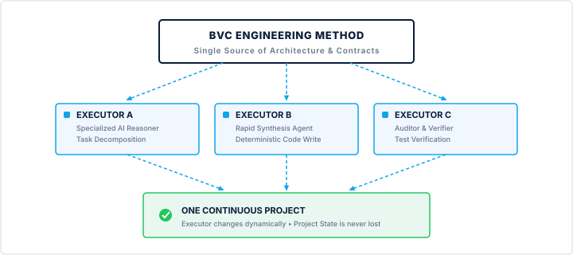
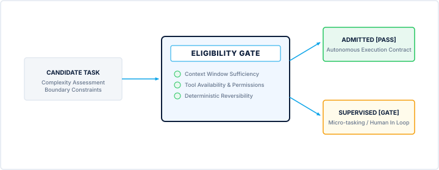
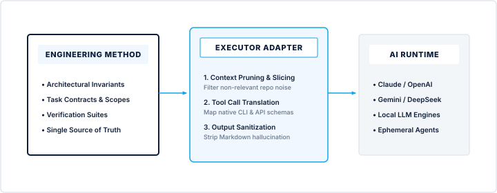
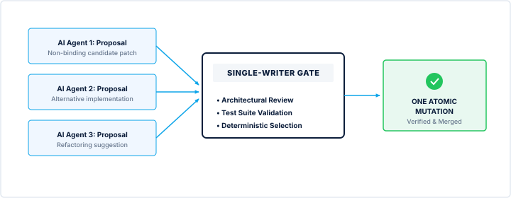
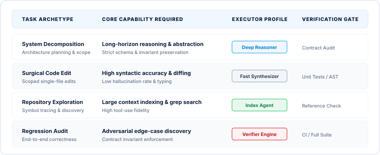
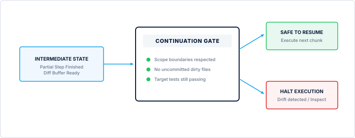
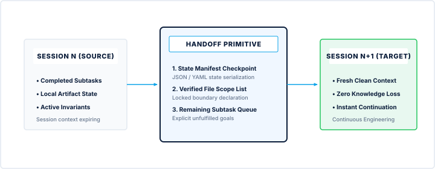

<!-- Canonical Structured Manuscript. PDF page chrome and pagination are not encoded here. -->

# CHƯƠNG 13
# TÔI KHÔNG MUỐN MỘT AI GIỎI HƠN. TÔI MUỐN PROJECT CÓ THỂ TIẾP TỤC
*Từ Continuity đến một hệ thống AI Engineering có thể thay đổi Executor mà không mất công việc*

Có một thời điểm tôi nhận ra rằng mình đã giải quyết được một vấn đề mà trước đó tôi nghĩ là rất lớn.
Tôi đã xây được continuity cho project.
Tôi đã có Knowledge.
Tôi có State.
Tôi có Evidence.
Tôi có Checkpoint.
Tôi có Handoff.
Tôi có Recovery.
Tôi có thể đóng một Engineering Run và mở một Run khác.
Nhưng ngay lúc đó, một câu hỏi khác xuất hiện.
Nó còn khó chịu hơn câu hỏi trước:
Nếu ngày mai tôi không dùng AI này nữa thì sao?
Không phải vì AI đó kém.
Ngược lại.
Có thể nó rất giỏi.
Có thể nó hiểu code rất nhanh.
Có thể nó sửa bug rất tốt.
Có thể nó đã quen với project.
Nhưng chính câu “nó đã quen với project” bắt đầu làm tôi thấy không yên tâm.
Bởi vì nếu một project chỉ tiếp tục được vì một AI cụ thể đã “quen” với nó, thì project vẫn đang phụ thuộc vào AI.
Tôi không muốn như vậy.
Tôi không muốn xây:
Một project dành cho Gemini.
Tôi không muốn xây:
Một project dành cho DeepSeek.
Tôi càng không muốn xây một hệ thống mà ngày mai phải bắt đầu lại chỉ vì tôi đổi provider.
Tôi muốn:

## TÔI ĐÃ TỪNG NGHĨ MODEL MẠNH HƠN SẼ GIẢI QUYẾT MỌI THỨ

Một project có thể tiếp tục.

AI nào đủ điều kiện thì thực hiện.

Executor nào phù hợp thì tiếp quản.

Project vẫn là một project.

Đó là lúc tôi bắt đầu nghĩ về một nguyên tắc đơn giản:

I don't need a better AI. I need a project that can continue.

Tôi đã từng nghĩ model mạnh hơn sẽ giải quyết mọi thứ Đây là một suy nghĩ rất tự nhiên.

Khi gặp một vấn đề với AI, phản ứng đầu tiên của tôi là:

“Có lẽ cần model tốt hơn.”

AI không hiểu architecture?

→ Dùng model mạnh hơn.

AI quên context?

→ Dùng context window lớn hơn.

AI viết code chưa đủ tốt?

→ Dùng model mới hơn.

AI làm task dài không ổn?

→ Dùng model mạnh hơn nữa.

Cách nghĩ đó có logic.

Bởi vì năng lực của model thực sự quan trọng.

Nhưng sau khi làm project đủ lâu, tôi thấy một nghịch lý:

Model mạnh hơn không tự động tạo ra một project mạnh hơn.

Một AI rất mạnh nhưng không biết project state có thể làm sai.

Một AI rất mạnh nhưng không biết authority boundary có thể làm quá phạm vi.

Một AI rất mạnh nhưng không có evidence có thể nói “Done” quá sớm.

Một AI rất mạnh nhưng không có continuity vẫn có thể khiến Run tiếp theo bắt đầu lại.

Vì vậy, có một distinction rất quan trọng:

```text
AI Capability
≠
Project Continuity
```

AI capability giúp AI làm tốt hơn.

Project continuity giúp project tiếp tục tốt hơn.

Tôi cần cả hai.

Nhưng hai thứ không phải một.

Một AI tốt không nên trở thành một dependency xấu

Tôi bắt đầu nhìn dependency theo một cách khác.

Dependency không chỉ là:

- thư viện;
- database;
- framework;
- cloud service.
Dependency cũng có thể là:

một AI cụ thể.

Nếu tôi cần đúng một model duy nhất để tiếp tục project, thì model đó đã trở thành một dependency rất đặc biệt.

Có thể provider:

- thay đổi giá;
- thay đổi quota;
- thay đổi policy;
- thay đổi capability;
- thay đổi interface;
- ngừng một model;
- làm model degraded;
- hoặc đơn giản là hôm nay model đó không available.
Project của tôi không thể dừng chỉ vì thế.

Đây là lý do tôi bắt đầu phân biệt:

AI dependency và:

AI capability.

Tôi muốn capability.

Tôi không muốn dependency không cần thiết.

Tôi muốn một project có thể đổi Executor

Trong chương trước, tôi đã định nghĩa Engineering Run.

Một Run là một khoảng thời gian thực thi engineering có kiểm soát, trong đó AI Executor hoặc developer thực hiện các task đã được cho phép.

Vậy nếu:

```text
RUN-010
Gemini
```

kết thúc thì sao?

Câu trả lời không nên là:

Project dừng.

Mà phải là:

```text
RUN-010
Gemini
↓
Checkpoint
↓
Handoff
```

```text
↓
RUN-011
DeepSeek
```

Và nếu DeepSeek không available:

```text
RUN-011
DeepSeek
↓
Unavailable
↓
RUN-012
```

Executor C

Project vẫn tiếp tục.

Đây là ý tưởng mà tôi muốn đạt được:

Executor Substitution.

Nói đơn giản:

Thay người thực thi mà không thay project.

Nhưng “đổi AI” không đơn giản là đổi tên model Đây là nơi tôi bắt đầu thấy vấn đề sâu hơn.

Nếu tôi chỉ nói:

“Gemini không làm nữa, đưa task cho DeepSeek.”

thì chưa đủ.

Bởi vì mỗi AI có:

- khả năng khác nhau;
- context limits khác nhau;
- tool support khác nhau;
- tốc độ khác nhau;
- mức độ ổn định khác nhau;
- cách xử lý ambiguity khác nhau.
Vì vậy, tôi không thể giả định:

“Cùng prompt = cùng behavior.”

Không.

Tôi cần một lớp contract ở giữa.

Tôi bắt đầu nghĩ:

```text
Project
↓
Engineering Method
↓
Semantic Contract
```

```text
↓
Executor Adapter
↓
AI Executor
```

## SEMANTIC CONTRACT

Executor thay đổi.

Nhưng contract không đổi.

### Semantic Contract

Semantic Contract là một tập quy tắc mô tả ý nghĩa của task mà không phụ thuộc vào cách một provider cụ thể biểu diễn prompt.

Nói đơn giản:

Tôi muốn định nghĩa “cần làm gì” và “thế nào là đúng” trước, rồi mới để từng AI chuyển nó thành cách thực thi phù hợp.

Ví dụ, task có thể được định nghĩa:

Task:
Add validation for customer electricity bill

input.
Scope:
Input validation

only.
Constraints:
Do not change calculation

logic.
Acceptance:
Invalid values are

rejected.
Verification:
Required validation tests

pass.
Authority:
Implementation allowed.
Schema change

not allowed.
Production release not allowed.

Gemini có thể nhận task này theo một prompt format.

DeepSeek có thể nhận theo một prompt format khác.

Nhưng semantics vẫn là một.

Đó chính là điều tôi cần.

Một prompt không phải là Engineering Method

Tôi muốn nhấn mạnh điều này vì nó rất dễ bị nhầm.

Prompt có thể nói:

“Please add validation…”

Nhưng Engineering Method phải nói nhiều hơn:

- task thuộc domain nào;
- scope ở đâu;
- authority đến mức nào;
- file nào được phép thay đổi;
- standard nào phải tuân theo;
- evidence nào cần;
- acceptance criteria là gì;
- verification thế nào;
- state nào có thể chuyển;
- những gì bị cấm.
Vì vậy:

```text
Prompt
↓
Interface
```

trong khi:

```text
Engineering Method
↓
Execution Contract
```

Prompt có thể thay đổi.

Method không được thay đổi tùy tiện.

Tôi muốn “One Method. Multiple Executors. One Project.”

Từ đó xuất hiện một nguyên tắc rất rõ:

```text
ONE METHOD
↓
MULTIPLE EXECUTORS
↓
ONE PROJECT
```

Tôi có thể dùng:

Gemini
DeepSeek
Executor C
Executor D

Nhưng tất cả đều phải làm việc bên trong cùng project semantics.

Không phải AI nào cũng làm mọi task.

Không phải AI nào cũng được quyền như nhau.

Nhưng AI nào được chọn thì phải hiểu:

Project đang yêu cầu điều gì.

Tôi không cần mọi AI giống nhau Đây là một điểm rất quan trọng.



*Một Method. Nhiều Executor. Một Project.* - Method + semantic contract + multiple executors.

Provider-neutral không có nghĩa:

Tất cả AI phải giống nhau.

Tôi không cần điều đó.

Gemini có thể tốt ở một loại task.

DeepSeek có thể tốt ở task khác.

Một local model có thể phù hợp với restricted data.

Một model khác có thể phù hợp với reasoning-intensive task.

Một executor có thể có tool support tốt hơn.

Executor khác có thể có chi phí thấp hơn.

Điều tôi cần là:

Different capabilities, shared engineering contract.

Tức là:

```text
Different Executors
↓
Same Project Semantics
↓
Same
```

```text
Governance
↓
Same State Model
↓
Same Verification
```

Principles Đó là interoperability ở cấp engineering.

Nhưng không phải task nào cũng có thể đổi Executor

Tôi cũng không muốn biến nguyên tắc này thành một khẩu hiệu quá đơn giản.

Có những task mà executor thay thế rất dễ.

Ví dụ:

- formatting;
- isolated UI change;
- simple unit test;
- documentation update;
- low-risk refactor.
Nhưng có những task cần capability đặc biệt.

Ví dụ:

- large-scale architecture migration;
- security-sensitive change;
- complex database migration;
- critical production incident;
- specialized domain reasoning.
Khi đó executor mới phải chứng minh rằng nó eligible.

Đây là điểm nối với routing logic.

Tôi không chọn executor chỉ vì:

“Nó còn quota.”

Tôi chọn executor vì:

Nó đủ điều kiện thực hiện task đó.

Eligibility phải đến trước Cost

Tôi muốn nhắc lại nguyên tắc mà tôi đã hình thành từ các chương trước.

Không phải:

```text
Cheapest AI
↓
Use it
```

Mà là:

```text
Data Sensitivity
↓
Security Boundary
↓
Governance
```

```text
↓
Capability
↓
State Compatibility
↓
Verification
```

```text
Capability
↓
Quality / Risk
↓
Availability / Quota
```

```text
↓
Effective Cost
```

Tức là:

Giá rẻ chỉ được xem xét sau khi AI đã đủ điều kiện.

Đây là lý do free-first không có nghĩa là free-only.

Gemini có quota miễn phí?

Tốt.

Dùng nếu đủ điều kiện.

Gemini hết quota?

DeepSeek có thể tiếp quản.

Nhưng nếu task chứa dữ liệu mà DeepSeek không được phép xử lý, thì không dùng DeepSeek chỉ vì nó available.

Security trước.

Authority trước.

Capability trước.

Cost sau.

State Compatibility trở thành cực kỳ quan trọng

Tôi đặc biệt chú ý đến một điều khi đổi AI:

Executor mới có thực sự hiểu State hiện tại không?

Ví dụ:

```text
Current State:
DATABASE MIGRATION = IMPLEMENTED
DATABASE
```

MIGRATION = NOT VERIFIED

Executor mới không được hiểu nó thành:

migration completed.

Nó phải giữ đúng distinction:

implemented nhưng chưa verified.

Hay:

Task Status = IN_PROGRESS không được tự biến thành:

completed.

Đây là lý do Project State phải có semantics rõ ràng.

Nếu không, mỗi AI sẽ tự diễn giải state theo cách riêng.



*Executor Eligibility Gate* - Eligibility must be checked before execution.

Khi đó continuity sẽ trở thành một ảo tưởng.

“Continue” không có nghĩa “start guessing”

Đây là một nguyên tắc tôi rất muốn giữ.

Khi AI mới nhận task chưa hoàn thành, nó rất dễ làm điều mà AI thường làm:

điền vào chỗ trống.

Ví dụ:

“Có vẻ như migration đã xong rồi.”

Hoặc:

“Có lẽ file này là implementation mới nhất.”

Hoặc:

“Tôi đoán requirement này đã được xác nhận.”

Không.

Continuity phải làm ngược lại.

Nếu state không rõ:

BLOCK.

Nếu evidence thiếu:

BLOCK.

Nếu handoff mâu thuẫn:

BLOCK.

Nếu authority không rõ:

BLOCK.

Nếu method version không tương thích:

BLOCK.

Đây là:

Fail Closed.

Continuity không phải giấy phép để AI tự suy đoán.

Continuity là cơ chế giúp AI không cần phải đoán.

Same Task không có nghĩa Same Prompt Đây là một distinction rất quan trọng.

Task:

“Implement customer validation.”

có thể được Gemini thực thi bằng prompt A.

DeepSeek thực thi bằng prompt B.

Một executor khác thực thi bằng prompt C.

Điều quan trọng không phải:

Prompt giống nhau.

Mà là:

Semantics giống nhau.

Ví dụ:

Task
Scope
Constraints
Acceptance
Evidence
Authorit

y phải giữ nguyên.

Provider adapter mới chịu trách nhiệm chuyển nó thành format phù hợp.

Đó là lý do tôi không muốn viết một “super prompt” khổng lồ để dùng cho mọi AI.

Tôi muốn có:

A stable engineering contract + provider-specific adapters.

Adapter là phần thay đổi. Method là phần ổn định.

Tôi hình dung kiến trúc như sau:

```text
ENGINEERING METHOD
│
↓
SEMANTIC CONTRACT
│
```

```text
┌────────────────┼────────────────┐
↓ ↓ ↓
Gemini Adapter
```

```text
DeepSeek Adapter Adapter C
↓ ↓ ↓
Gemini DeepSeek Executor C
```

Adapter xử lý:

- prompt formatting;
- tool invocation;
- provider-specific syntax;
- response parsing;
- environment-specific execution.
Method xử lý:

- engineering rules;
- task semantics;
## TÔI KHÔNG MUỐN “AI PERSONALITY DRIFT” BIẾN THÀNH ENGINEERING DRIFT

- authority;
- state;
- verification;
- evidence;
- handoff.
Đây là cách tôi giảm coupling.

### Tôi không muốn “AI Personality Drift” biến thành Engineering Drift

Mỗi AI có một phong cách.

AI này thích viết dài.

AI kia thích refactor nhiều.

AI khác thích đổi folder.

AI nọ thích thêm abstraction.

Đó là điều không thể tránh hoàn toàn.

Nhưng nếu để personality quyết định engineering style, project sẽ drift.

Ví dụ:

Run này:

snake_case

Run sau:

camelCase

Run tiếp:



*Engineering Method và Executor Adapter* - Stable method, provider-specific adapters.

Repository Pattern

Run sau:

Direct SQL

Mỗi thay đổi riêng lẻ có thể “hợp lý”.

Nhưng tổng thể project trở thành một mớ.

Đó là Engineering Style Drift.

Tôi cần Method Lock Đây là nơi tôi bắt đầu đưa Engineering Method trở thành một artifact có version rõ ràng.

Ví dụ:

```text
engineering_method:
id: ENERIX-EM
version: "1.2"
commit:
```

af82d1
sha256: "..."

Executor phải load đúng method.

Nếu executor dùng method khác:

```text
METHOD COMPATIBILITY CHECK
↓
FAIL
↓
EXECUTION
```

BLOCKED

Điều này nghe rất nghiêm.

Nhưng nếu tôi muốn nhiều AI cùng làm một project, tôi cần một cách chứng minh rằng:

Chúng đang làm cùng một loại engineering.

Không nhất thiết cùng wording.

Không nhất thiết cùng interface.

Nhưng cùng method.

Tôi muốn project có “Style Memory”

Đây là nơi Knowledge quay trở lại.

Project phải biết:

- naming conventions;
- folder conventions;
- error handling;
- API patterns;
- database conventions;
- test conventions;
- documentation conventions;
- security boundaries.
Không phải để AI “học” bằng cách đọc toàn bộ code mỗi lần.

Mà để AI có canonical source.

Tôi có thể gọi nó:

Engineering Style Knowledge.

Và hệ thống có thể detect drift.

Ví dụ:

Task mới đề xuất một API pattern chưa được project standard cho phép.

Hệ thống có thể cảnh báo.

Không phải vì AI viết code sai cú pháp.

Mà vì:

AI đang làm project lệch khỏi cách project đã được thiết kế.

### Tôi bắt đầu thấy “AI Team” theo một nghĩa khác

Tôi không muốn tạo ra:

“Ba AI cùng code một project.”

Tôi muốn:

Một engineering system có nhiều executor.

Đó là khác biệt rất lớn.

Ví dụ:

```text
Executor A
→ Analyze
Executor B
→
```

```text
Implement
Executor C
→ Review
Executor D
→
```

Verify

Nhưng tất cả cùng nhìn vào:

```text
ONE PROJECT STATE
ONE KNOWLEDGE BASE
ONE METHOD
ONE
```

GOVERNANCE

Đó mới là cách nhiều AI có thể tạo ra leverage.

Không phải bằng cách cho tất cả cùng chạm vào mọi thứ.

Mà bằng cách chia capability nhưng giữ canonical state.

Tôi không muốn “AI Team” trở thành nhiều nguồn sự thật

Nhiều AI không có nghĩa nhiều nguồn sự thật.

Nếu:

Gemini says A
DeepSeek says B
Executor C says C

thì project không được chuyển thành:

A/B/C đều đúng.

AI chỉ tạo proposal.

Authority mới quyết định.

Evidence mới kiểm chứng.

State mới ghi nhận kết quả.

Vì vậy:

```text
AI A → Proposal A
AI B → Proposal B
AI C → Proposal C
```

```text
↓
Authority / Review
↓
ONE AUTHORIZED CHANGE
```

Đó là cách nhiều AI có thể cùng tham gia mà không tạo ra nhiều “truth”.

Discovery và Execution vẫn phải tách biệt

Nhiều AI rất hữu ích trong discovery.

Tôi có thể cho ba AI cùng xem architecture và hỏi:

“Bạn thấy rủi ro gì?”

Kết quả có thể là:

```text
AI A → Risk A
AI B → Risk B
AI C → Risk C
```

Điều đó rất hữu ích.

Nhưng tôi không muốn:

ba AI cùng sửa code.

Discovery có thể song song.

Execution canonical nên được kiểm soát.

Đây là lý do tôi giữ boundary:

```text
DISCOVERY
↓
PROPOSAL
↓
AUTHORIZED EXECUTION
```

```text
↓
VERIFICATION
↓
STATE UPDATE
```

Nhiều AI có thể mạnh ở phía trước.

Canonical change vẫn đi qua một execution path có authority.

### Tôi bắt đầu thấy “AI Team” theo một nghĩa khác

Tôi không muốn tạo ra:

“Ba AI cùng code một project.”

Tôi muốn:

Một engineering system có nhiều executor.

Đó là khác biệt rất lớn.

Ví dụ:

```text
Executor A
→ Analyze
Executor B
→
```

```text
Implement
Executor C
→ Review
Executor D
→
```

Verify

Nhưng tất cả cùng nhìn vào:

```text
ONE PROJECT STATE
ONE KNOWLEDGE BASE
ONE METHOD
ONE
```

GOVERNANCE

Đó mới là cách nhiều AI có thể tạo ra leverage.

Không phải bằng cách cho tất cả cùng chạm vào mọi thứ.

Mà bằng cách chia capability nhưng giữ canonical state.

### Một executor tốt phải biết mình không được làm gì

Tôi ngày càng đánh giá cao khả năng:



*Nhiều AI có thể đề xuất. Chỉ một thay đổi được phép.* - Multiple proposals, one authorized change.

## EXECUTOR ELIGIBILITY, ROUTING VÀ CONTROLLED CONTINUATION

### Not Do.

Một AI tốt không chỉ biết:

“Tôi có thể làm gì?”

Nó phải biết:

“Tôi không được làm gì.”

Ví dụ:

```text
Allowed:
- inspect files
- modify implementation
- run
```

```text
tests
Not Allowed:
- change architecture
- modify
```

production data
- release
- alter governance

Đây chính là Controlled Autonomy.

Tự động hóa tốt không phải:

AI được làm tất cả.

Mà là:

AI được tự chủ bên trong một boundary có thể kiểm soát.

Executor Capability Matrix

Khi nhiều executor tồn tại, tôi cần biết executor nào làm được gì.

Bảng này không phải để xếp hạng AI.

Nó để trả lời:

Executor nào eligible cho task nào?

Đó là routing.

Không phải fan club.

Tôi không muốn routing trở thành một lịch cố định Đây cũng là một bài học quan trọng.

Tôi có thể có một preference:

Gemini ưu tiên khi quota phù hợp.

DeepSeek là paid acceleration hoặc fallback.

Tôi có thể có economic preference theo những khoảng thời gian nhất định.

Nhưng tôi không muốn hard-code:

8h dùng AI A.

18h dùng AI B.

Bởi vì eligibility thực tế có thể thay đổi.

Gemini có thể hết quota lúc 11 giờ.

DeepSeek có thể trở thành executor phù hợp ngay lúc đó.

Đến 14 giờ Gemini có quota lại.

Tôi có thể chuyển lại.

Routing phải dựa trên:

Current eligibility.

Không phải đồng hồ.



*Executor Capability Map* - Routing based on current eligibility.

### Project không nên quan tâm “AI hôm nay là ai”

Đây là một câu hỏi thú vị.

Nếu executor có thể thay đổi, project không nên cần biết:

“Người này là Gemini.”

Project chủ yếu cần biết:

“Executor hiện tại có đủ điều kiện không?”

Đó là abstraction:

```text
AI EXECUTOR
│
┌───────────────┼───────────────┐
↓ ↓ ↓
```

Gemini DeepSeek Executor C

Tên model là implementation detail.

Engineering role mới là thứ project cần.

Tôi bắt đầu phân biệt “Model Identity” và “Executor Identity”

Một model có thể được sử dụng qua nhiều environment.

Ví dụ:

```text
DeepSeek
↓
Codex
↓
Local VS Code
```

Hay:

```text
Gemini
↓
Google AI Studio
```

Model là một thứ.

Environment là một thứ khác.

Executor là abstraction để project giao việc.

Vì vậy tôi không nên viết:

“GAIS làm task.”

Mà chính xác hơn:

Gemini thực hiện task trong Google AI Studio.

Hoặc:

DeepSeek thực hiện task thông qua Codex trong local environment.

Điều này tưởng nhỏ.

Nhưng nếu sai terminology, architecture sẽ bắt đầu sai theo.

### Terminology cũng là một phần của Continuity

Khi đổi AI, một vấn đề ít được chú ý xuất hiện:

“Cùng một từ nhưng khác nghĩa.”

Ví dụ:

- session;
- run;
- task;
- state;
- checkpoint;
- completion;
- verification;
- done.
Nếu Gemini hiểu “session” theo một nghĩa và DeepSeek hiểu theo nghĩa khác, continuity đã bị phá.

Đó là lý do tôi cần một Terminology Standard.

Ví dụ:

Engineering Run là canonical term.

Không dùng “Engineering Session” làm thuật ngữ chính.

Bởi vì “session” có thể là:

- PHP session;
- HTTP session;
- authentication session;
- database session;
- AI chat session.
Tôi không muốn ambiguity đi theo project.

### Một project trưởng thành phải có Semantic Authority

Terminology vẫn chưa đủ.

Tôi còn cần xác định artifact nào có authority cao hơn.

Ví dụ:

```text
Current State
↓
Authoritative
```

Trong khi:

```text
Old Chat Summary
↓
Non-canonical
```

Hay:

```text
Proposal
↓
Not authoritative until approved
```

Đây là Semantic Authority.

Nó trả lời:

“Khi hai nguồn nói khác nhau, tôi tin nguồn nào?”

Không có authority hierarchy, nhiều AI sẽ tạo ra nhiều phiên bản sự thật.

### “Latest” không đồng nghĩa “Correct”

Một AI có thể đọc file mới nhất.

Nhưng file mới nhất không nhất thiết là canonical.

Một document sửa hôm qua có thể đã bị superseded.

Một proposal mới có thể chưa được approved.

Một state snapshot mới hơn có thể chưa verified.

Vì vậy:

Newest
≠
Authoritative

Tôi cần authority resolution.

Đó là lý do retrieval system của tôi không chỉ tìm cái “giống nhất”.

Nó phải biết:

cái nào có quyền nói sự thật.

Similarity không phải truth.

### Tôi muốn AI mới có thể nói “Tôi chưa đủ điều kiện”

Điều này nghe rất đơn giản.

Nhưng nó có giá trị cực lớn.

Khi DeepSeek nhận một task từ Gemini:

DeepSeek không nên cố chứng minh mình có thể tiếp tục bằng mọi giá.

Nó phải có thể nói:

“Required evidence is missing.”

hoặc:

“Current state conflicts with handoff.”

hoặc:

“Task authority does not permit this action.”

hoặc:

“Required capability is unavailable.”

Khi đó execution chuyển sang:

BLOCKED

chứ không phải:

guess.

Đó là một trong những đặc tính tôi muốn nhất ở một AI Executor.

### Tôi không muốn “Continuity” biến thành “Automation at Any Cost”

Có một cám dỗ rất lớn sau khi xây được một hệ thống continuity:

“Nếu đã có state rồi, hãy cho AI tự động tiếp tục.”

Tôi không đồng ý.

Continuity không làm mất governance.

Nó làm governance dễ thực thi hơn.

Project có thể tiếp tục.

Nhưng tiếp tục có điều kiện.

Ví dụ:

```text
State valid?
↓ yes
Task authorized?
↓
```

```text
yes
Executor eligible?
↓ yes
Evidence
```

```text
sufficient?
↓ yes
Method compatible?
↓
```

```text
yes
Workspace unlocked?
↓ yes
→ EXECUTION
```

AUTHORIZED

Một điều kiện fail:

→ BLOCK Đó mới là controlled continuity.

Handoff chính là nơi Continuity và Multi-AI gặp nhau

Nếu chỉ một AI duy nhất làm project, handoff vẫn hữu ích.

Nhưng khi có nhiều AI, handoff trở thành critical.

Bởi vì:

Handoff không chỉ là continuation.

Nó là:

executor substitution boundary.

Nó đảm bảo AI mới không phải “tin lời AI cũ”.

AI mới đọc artifacts.

AI mới verify.

AI mới tiếp tục.



*Controlled Continuation Gate* - All required conditions must pass.

## TÔI MUỐN KIỂM TRA MỘT HỆ THỐNG BẰNG MỘC CÂU HỎI DUY NHẤT

### Tôi muốn kiểm tra một hệ thống bằng một câu hỏi duy nhất

“Tắt AI hiện tại đi. Project có tiếp tục được không?”

Nếu câu trả lời là:

Có.

Tôi đang có progress.

Nếu câu trả lời là:

Không, vì AI đó nhớ nhiều thứ mà project không lưu.

Tôi đang có dependency.

Nếu:

Không, vì AI mới không biết context.

Tôi đang có continuity gap.

Nếu:

Không, vì task state không rõ.

Tôi đang có state gap.

Nếu:

Không, vì không biết ai có authority.



*Handoff là một Engineering Primitive* - State synchronization makes substitution possible.

Tôi đang có governance gap.

Một câu hỏi, nhưng nó expose rất nhiều điểm yếu.

Tôi cũng muốn hỏi câu ngược lại

“Tôi có thể thay AI mà không thay method không?”

Nếu:

Có.

Tôi có provider flexibility.

Nếu:

Không.

Tôi đang coupling method vào provider.

Đó là một coupling mà tôi muốn giảm.

Đây là điều tôi thực sự muốn xây

Cuối cùng, tôi không xây:

một AI có memory thật tốt.

Tôi không xây:

một prompt khổng lồ.

Tôi không xây:

một workflow phụ thuộc vào Gemini.

Tôi xây:

```text
ONE PROJECT
↓
ONE METHOD
↓
ONE GOVERNANCE
```

```text
↓
ONE STATE
↓
ONE EVIDENCE MODEL
↓
ONE
```

```text
CONTINUITY MODEL
↓
MULTIPLE ELIGIBLE EXECUTORS
```

AI nào phù hợp thì làm.

AI nào không phù hợp thì không làm.

Project vẫn là một project.

Điều này làm tôi thay đổi định nghĩa “AI-powered”

Một sản phẩm không thật sự “AI-powered” chỉ vì nó dùng AI để generate code.

Một engineering system mới thực sự tận dụng AI khi:

AI có thể tham gia execution mà không làm mất tính nhất quán của project.

Đó là một mức cao hơn.

Không phải:

AI writes more.

Mà:

AI participates safely and continuously.

Tôi bắt đầu nhìn tương lai theo hướng khác

Tôi không nghĩ tương lai là:

Một AI duy nhất làm tất cả.

Tôi cũng không nghĩ tương lai là:

20 AI cùng tranh nhau chỉnh một repository.

Tôi nghĩ tương lai gần hơn với:

```text
One Engineering System
│
├── Executor A
├── Executor B
```

```text
├── Executor C
├── Human
└── Specialized Tools
```

Tất cả thực thi trong:

một project có state và governance.

Đó là một hệ sinh thái executor.

Và tôi thấy một điều rất đẹp trong kiến trúc này

AI không còn phải là “người đồng đội duy nhất” của tôi.

Nó có thể là:

- worker;
- reviewer;
- analyst;
- implementer;
- tester;
- diagnostician.
Một AI có thể đến.

Một AI có thể đi.

Một người có thể tiếp quản.

Một tool khác có thể xử lý.

Nhưng project không phải bắt đầu lại.

Bởi vì:

Project remembers itself.

### Reality Check

Tôi muốn tránh một hiểu lầm rất dễ xảy ra.

“Executor-Agnostic” không có nghĩa:

đổi AI là mọi thứ tự động hoạt động.

Không.

Đổi AI vẫn có chi phí.

Vẫn cần:

- eligibility;
- context compilation;
- state verification;
- method compatibility;
- handoff;
- workspace control;
- evidence;
- verification.
Mục tiêu không phải là:

zero cost switching.

Mục tiêu là:

controlled switching with predictable continuity.

Đó là khác biệt giữa một hệ thống có architecture và một lời hứa marketing.

### Điều tôi học được

Tôi bắt đầu bằng suy nghĩ:

“Tôi cần AI mạnh hơn.”

Sau đó tôi nghĩ:

“Tôi cần AI nhớ project.”

Rồi tôi nhận ra:

Tôi không cần AI nhớ. Tôi cần project nhớ.

Tiếp theo:

Tôi không cần AI duy nhất.

Tôi cần:

nhiều executor có thể thay thế nhau.

Nhưng muốn thay thế:

không thể chỉ đổi model.

Tôi cần:

một Engineering Method chung.

Muốn giữ method:

cần Semantic Contract.

Muốn giữ truth:

cần State + Evidence + Authority.

Muốn tiếp tục:

cần Checkpoint + Handoff + Recovery.

Muốn nhiều AI cùng làm:

cần Controlled Autonomy.

Và cuối cùng:

AI có thể thay đổi. Project không được mất khả năng tiếp tục.

Đó là lúc tôi thực sự hiểu câu:

I don't want a better AI. I want a project that can continue.

## CHUYỂN TIẾP

Nhưng đến đây, tôi lại gặp một câu hỏi khác.

Tôi đã có:

Project có thể tiếp tục.

Tôi có:

nhiều AI có thể thay phiên.

Tôi có:

một Engineering Method chung.

Tôi có:

State, Evidence, Handoff và Recovery.

Nhưng liệu tất cả những thứ đó có thật sự giúp tôi xây một sản phẩm không?

Bởi vì một project có thể tiếp tục coding mãi mà vẫn không trở thành product.

AI có thể hoàn thành hàng trăm task.

Git có thể có hàng nghìn commit.

State có thể được cập nhật mỗi ngày.

Nhưng cuối cùng, người dùng có nhận được một thứ có giá trị không?

Tôi bắt đầu nhận ra một sự thật khó chịu:

Code Progress không đồng nghĩa với Product Progress.

Và đó là lúc câu hỏi thay đổi một lần nữa:

AI có thể viết code. Nhưng AI có đang xây sản phẩm không?

Đó là câu hỏi tôi phải giải quyết tiếp theo.


---

## NAVIGATION TREE

<!--
CHƯƠNG 13 - TÔI KHÔNG MUỐN MỘT AI GIỎI HƠN. TÔI MUỐN PROJECT CÓ THỂ TIẾP TỤC
├── TÔI ĐÃ TỪNG NGHĨ MODEL MẠNH HƠN SẼ GIẢI QUYẾT MỌI THỨ
├── SEMANTIC CONTRACT
├── TÔI KHÔNG MUỐN “AI PERSONALITY DRIFT” BIẾN THÀNH ENGINEERING DRIFT
├── EXECUTOR ELIGIBILITY, ROUTING VÀ CONTROLLED CONTINUATION
└── TÔI MUỐN KIỂM TRA MỘT HỆ THỐNG BẰNG MỘC CÂU HỎI DUY NHẤT

Navigation metadata only. It does not encode PDF coordinates.
-->
